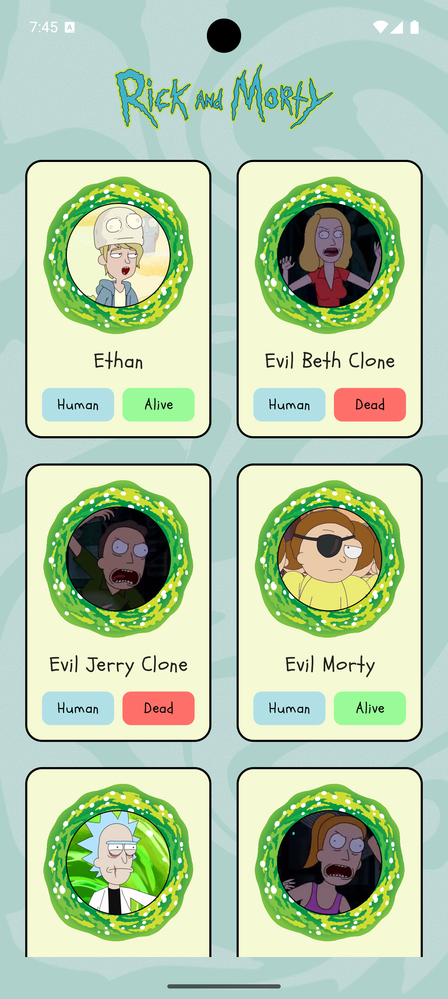
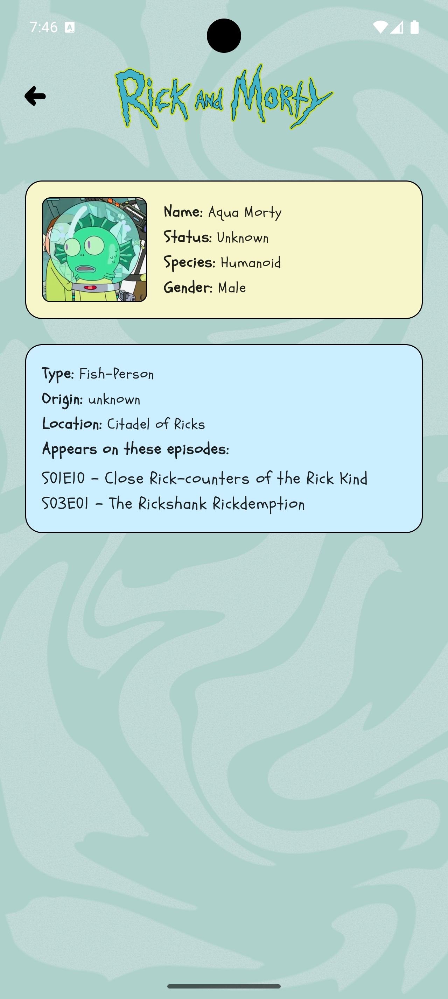
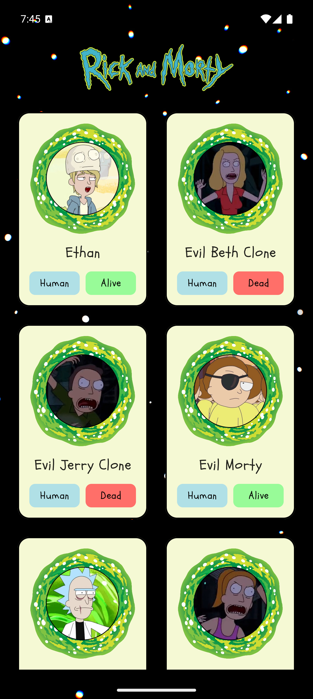
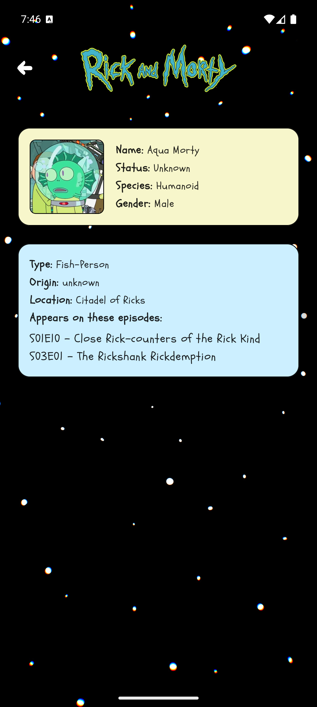
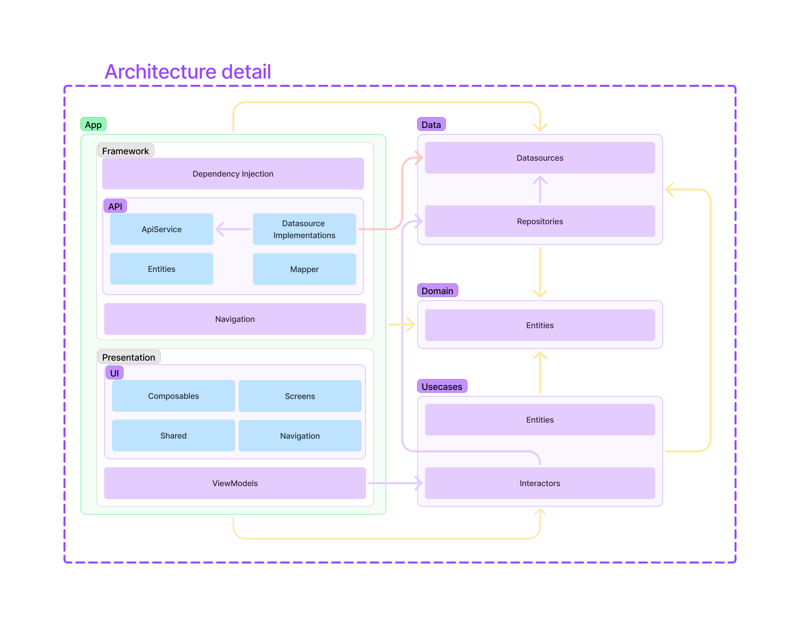
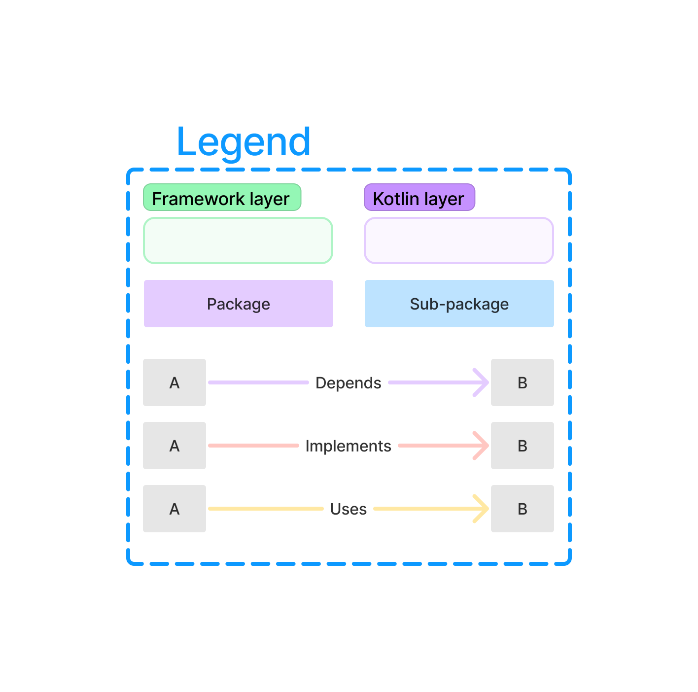

# Rick & Morty App 🛸

Welcome! This app was developed as part of a technical guide to improve skills in architecture, modern Android development, best practices, and user experience.

Explore the characters of **Rick & Morty** with a clean, fast, and fluid experience — and with style!

---

## ✨ Main Features

- ✅ Paginated list of characters
- ✅ Detail screen with extended information
- ✅ Episode loading per character
- ✅ Custom illustrated interface
- ✅ Dark mode support
- ✅ Image caching
- ✅ Error handling & UI state management
- ✅ Clean and decoupled architecture
- ✅ Offline image support
- ✅ Dependency injection with Hilt
- ✅ Built 100% with Jetpack Compose & Kotlin

---

## 📷 Screenshots

### 🌞 Light Mode

| Character List | Character Detail |
|----------------|------------------|
|  |  |

### 🌙 Dark Mode

| Character List | Character Detail |
|----------------|------------------|
|  |  |

---

## 🧱 Architecture

This app follows a **modular Clean Architecture**, based on **SOLID principles** and separation of concerns.

### 🔍 Overview

### 🧩 Package Detail

### 🗺️ Legend

---

## 🛠️ Tech Stack
g
- **Language**: Kotlin
- **UI Toolkit**: Jetpack Compose
- **Architecture**: Clean Architecture
- **Dependency Injection**: Hilt
- **Networking**: Retrofit + OkHttp
- **State Management**: StateFlow + Compose
- **Navigation**: Navigation Compose
- **Testing**: JUnit, MockK

---

## 📂 Project Structure

The app is organized in modules following Clean Architecture principles:
📦 app/
├── framework/         # DI, navigation, configuration, API
├── presentation/      # Composables, ViewModels, navigation

📦 data/
├── datasources/       # Data source contracts
├── repositories/      # Repository implementations

📦 domain/
└── entities/          # Domain entities

📦 usecases/
├── interactors/       # Use cases (business logic)
└── entities/          # Shared entities across layers

---

## ⚙️ Getting Started

1. Clone the repository
2. Open the project in **Android Studio Hedgehog or newer**
3. Run on a physical or virtual device (API 24+)
4. Explore the multiverse!

---

## 🧪 Testing

Unit testing is planned and structured as follows:

- 🧪 **Use Cases** – Each use case (interactor) will be tested to validate business logic independently of data sources.
- 🧪 **Repositories** – Repository implementations will be tested to verify correct handling of data from remote sources and proper mapping to domain models.
- 🧪 **ViewModels** – ViewModels will be tested to ensure proper UI state management and interaction with use cases.

The architecture is built with testability in mind. While UI tests are not yet included, the project is ready to support them in future iterations using tools like Jetpack Compose testing and Espresso.

---

## 💡 Technical Decisions

- Clean Architecture layers have been implemented in modules for a much strict control between boundaries
- The project is **modularized by package**, with domain at the core
- `Dto`s and `Entities` are separated for easier maintenance
- Caching is currently limited to images to simplify the MVP

---

## 📬 Contact

Developed by **David Cuyàs**  
[LinkedIn](https://linkedin.com/in/davidcuyas) · [GitHub](https://github.com/davidcuyas)

---

> “Wubba Lubba Dub-Dub!” — Rick Sanchez